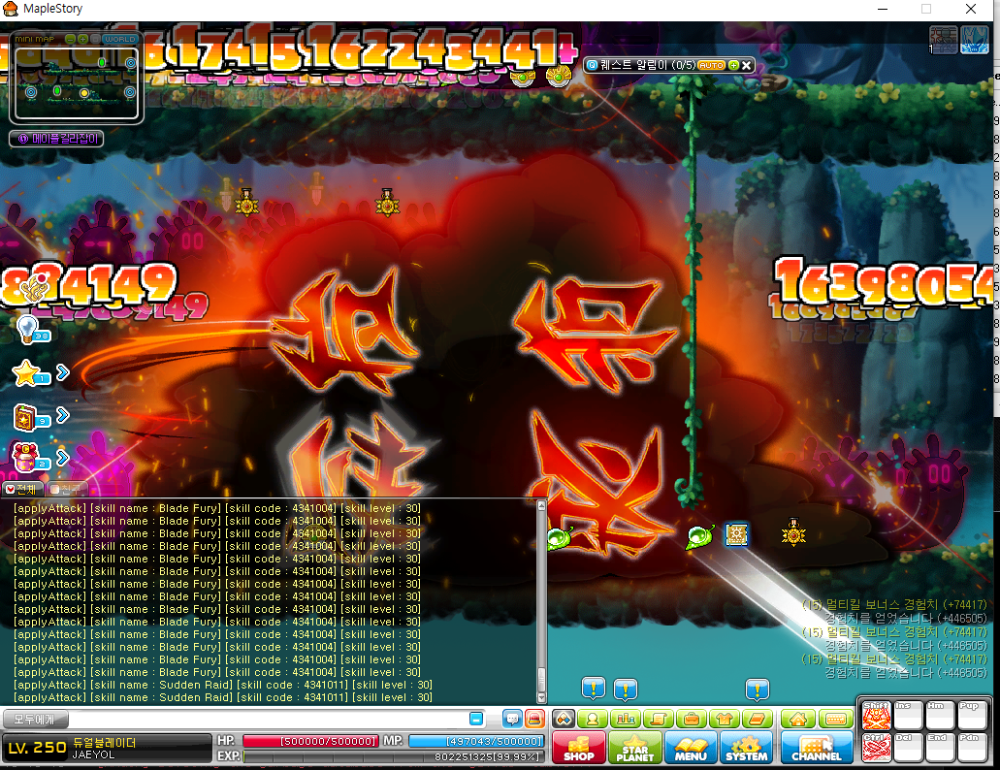
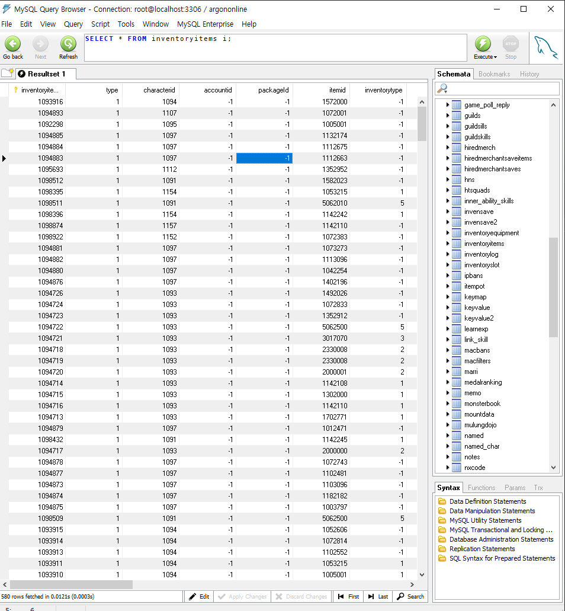

# Argon MS - Maplestory Server & Client Clone Project

[![Contributors][contributors-shield]][contributors-url]
[![Forks][forks-shield]][forks-url]
[![Stargazers][stars-shield]][stars-url]
[![Issues][issues-shield]][issues-url]
[![MIT License][license-shield]][license-url]
[![LinkedIn][linkedin-shield]][linkedin-url]

Welcome to Argon MS, a clone project of the popular game Maplestory, Server & Game development + translating in to English (GMS standard)

**\*Please note that all rights related to the original game Maplestory belong to Nexon. This project is a clone and is not affiliated with Nexon.**




Client Version used for the development: **KMST v1029** (KMS Tespia Client)

## 🛠️ - Built with

[![Java][Java]][Java-url] [![MySQL][MySQL]][MySQL-url] [![MariaDB][MariaDB]][MariaDB-url] [![Javascript][Javascript]][Javascript-url] [![OllyDBG][OllyDBG]][OllyDBG-url] [![XML][XML]][XML-url]

### 🛠️- Used Tools

- **Java JDK 8**: ☕ The core language used for development.
- **MariaDB**: 🗃️ Used for the server database.
- **MySQL Client**: 📊 Used for database management.
- **SQL**: 📑 Managing and manipulating the database.
- **JavaScript**: 📜 Used for creating NPC scripts.
- **OllyDBG**: 🔍 Client Reverse Engineering.
- **Bash**: 🖥️ Used for scripting and automation.
- **WIZET**: Game image data files.
- **[HaRepacker](https://github.com/lastbattle/Harepacker-resurrected)**: Wizet Editing and Modifying
- **XML**: 📦 Used for storing data in a format that can be easily shared.



## Getting Started

These instructions will get you a copy of the project up and running on your local machine for development and testing purposes.

### Prerequisites

[![Java JDK 8][Java JDK 8]][Java JDK 8-url] [![MariaDB][MariaDB]][MariaDB-url] [![MySQL Client][MySQL Client]][MySQL Client-url]

### Setup

**You should have a database environment setup on your machine**

1. Clone the repo

   ```sh
   git clone https://github.com/yiwoduf/Argon-MS.git
   ```

2. Build the project using JDK 8
3. Load Saved SQL Table `./propety/Sql/argon_beta_test_server 20180506 1239.sql`
4. Modify Server Config file

```
   ./property/Setting/ServerSetting.properties
```

### Server Configuration Guide

```js
#   [MAP SETTING]
시작맵 = 350140100 // Start Map
마을맵 = 100000000 // Main Village Map

#   [배율설정]
경험치배율 = 10 // EXP gain rate
메소배율 = 1 // Meso gain rate
드롭배율 = 1 // Drop rate
캐시배율 = 1 // Cash rate
보스캐시배율 = 4 // Boss Cash rate

#   [개수설정]
최대드랍아이템개수 = 4 // Max Drop Items
최대보스드랍아이템개수 = 4 // Max Boss Drop Items
서버개수 = 5 // Server (Channel) Count
캐릭터슬롯 = 4 // Char slot (initial)
아이피당계정수 = 3 // Max # of Accounts per IP

#   [서버상태설정]
Flag = 2
아이피 = 127.0.0.1 // Your IP
이벤트 = 1
로그인포트 = 8484 // Login Port
채널포트 = 8585 // Channel Port
캐시샵포트 = 8700 // Cash Shop Port
친구서버포트 = 9900 // Friend Server Port

#   [기타설정]
서버점검 = false // Server Maintenance
패킷출력 = true // Print out Packets
최대드랍사용 = true // Use Max Drop
최대보스드랍사용 = true // Use Max Boss Drop
붐업경험치이벤트 = false // 'Boom-Up' EXP Event

#   [DB]
Arc.dbHost = localhost // Database IP
Arc.dbPort = 3306 // Database Port
Arc.dbUser = root // Database Login
Arc.dbPassword =

#    [클라이언트 버전]
클라이언트버전 = 1029 // Client Version
마이너버전 = 1 // Minor Version

```

## Using The Launcher

```
Server should be opened right away.

*Make sure to give it about 5 minutes for char DB connection
```


### Most Recent Development Log:

```
Argon Online Development Log _ @yiwoduf

[FIX] - FIXED
[ISSUE] - Can think about it later, kinda easy to fix maybe
[COMPLETE] - completed and checked
[] - Needs to be done

001. [FIX] - Evan Fushion Skills are not working properly (Packet) Credit. @Song Min Woo
002. [FIX] - Evan's Dragon Mir gets smaller whenever you return to mainMap
003. [FIX] - Boss Monster doesn't drop Items that are in database (drop_data)
004. [FIX] - Blaster 'Hyper Magnum Punch' Skill doesn't give damage to mob
005. [FIX] - Evan after use of Hyper 'Dragon Master'Mir Dissapears (can't use skill) Credit. 송민우
006. MobHandler - movemonster or something error keeps apearing on promt. Have no idea what is wrong. No effect in game.
007. [COMPLETE] - if Player isGM, print Skill information
008. [COMPLETE] - Kinesis, Grab and few other skills don't work (키네시스 각종 오류 : PsychicEnergeShield PlayerStats.java 에 추가)
009. [] - Need to add WildHunter Jaguar changing script npc on keyvalue2
010. [] - Need to check if Auction system is working
011. [COMPLETE] - Memory cleaning system check
012. [FIX] - Wild Hunter Jaguar riding buffstat is not working right
013. [COMPLETE] - Mechanic Job riding Buffstat system needs to be fixed
014. [FIX] - Kinesis no damage to mobs when it has Donation Point damage (addDamage)
015. []- wz_mobskilldata query table is mossing. I need to add based on what info it has
016. [COMPLETE] - Translate and clean admin tool
017. [COMPLETE] - check addDamage and addDamageHit system
018. [FIX] - Additional hit gainAddDamageHit method does not work propertly (MapleCharacter.java)
019. [COMPLETE] - Need to add gainAddDamageHit npc script : 9000224
020. [] - Need to change and design JOB selecting npc (it looks dirty)
021. [] - Pinkbean event from my old server pack needs to be copied to argon (job with mikhail)
022. [FIX] - Aran Combo resets when it reaches 50 (applyComboBuff)
023. [] - Aran exceeds 1000 combo, adrenaline boost needs to happen
024. [] - GM Command !하이드 doesn't work properly
025. [COMPLETE] - Add Damage Skin array to Source
026. [COMPLETE] - Add New Ridings in Client (I have no idea how to add skill.wz, but riding it self is in it)
027. [FIX] - Character does not get Riding BuffStat. It says 'unknown error'
028. [FIX] - SkillStatEffect Riding buffstat error
029. [] - Need to add flyriding system to argon from aplus ( giveSpecialMount )
030. [COMPLETE] - Disable not used AdminTool (ChatHandler.Java) (Start.java)
031. Some damages with damageskin does not apply (must be a damage that is not applied)
032. [FIX] - InGame Chat is delayed. It responds 10sec~1min late( private void broadcastMessage / MapleMap.java )
033. [FIX] - Block Multi Loading Client does not work properly. Sometimes your cannot log back in.
034. [COMPLETE] - Add Trash Query Database cleaner
035. [FIX] - Evan 'Dragon Master' overlaps with other Ridings, so it doesn't work properly
036. [FIX] - ^ Why? 'Dragon Master' was in isMonsterRiding(), but separated to isEvanDragonMaster()
037. [] - 'Epic potential scroll 100%' says it's failed when item already has rare potential. It succeeds, but it says it failed.
038. [] - 'Unique potential scroll 100%' doesn't work at all
039. [] - In Database shop, the install tab sometimes is gone, and sometimes dissapears.
040. [FIX] - Return Town Scroll doesn't work (opcode + source) (modified to come to ServerConstants.mainMap)
041. [FIX] - Equi backup system doesn't work : 9000217 (Maybe check query)
042. [FIX] - Meso > Cash / Cash > Meso Market doesn't work (query)
043. [COMPLETE] - All source that goes to henesys individually was changed to ServerConstants.mainMap so they are equal (각종 마피아게임, 데미지측정, 결혼 등 다 이걸로이동)
044. [] - Function Systems from my old pack need to be added to argon
045. [] - Contents/Features Systems from my old pack need to be added to argon
046. [] - Add missing query tables and clean un-needed tables
047. [ISSUE] - Link Skills needs to be checked (I think some jobs don't work)
048. [ISSUE] - Does profession work? it should, but I need to check npc scripts
049. [] - Re design rebirth system
050. [] - Add pandora box system
051. [] - Fishing Feature doesn't work
052. [FIX] - Monster Park doesn't work (still need to add scripts and modify)
053. [FIX] - When you buy set items (ex. set of 100) from shops it only gives you 1
054. [FIX] - After you buy items from shops, there is a delay that makes you cant buy items
055. [ISSUE] - Zero gets weird after job script, It says this job cant have that item -_- just weird, but I will find them why
056. [ISSUE] - Zero beauty system needs to be checked like hair and face for individual sex, male and female
057. [ISSUE] - Zero, Beta isn't holding a cash weaponn in character select screen even when it is equipped. It is on when you are in game tho.
058. [COMPLETE] - Zero weapon upgrade needs to be set all the way up to new LV. 200 weapons (1029 only allows til lv 150 ones)
059. [] - Zero weapon damage and options needs to be changed to actual server like. I just copied and paste the option from now.

060. [FIX] - Zero Skill Master problem. Hyperskill wont show up : MapleCharacter.zeroSkillMaster();
061. [FIX] - Lags when you use town return scroll
062. Need to implement new soul weapons (Demian, Lucid)
063. [FIX] - Admin Command 'delete NPC' not working
064. [FIX] - NPC creation script not working properly - AutoNPCWriter
065. [COMPLETE] - Implement Gemstone (Nodestone) System
066. [] - Zakum, etc error with XML files - need to export from originial IMG files
067. [FIX] - ** Class 'Zero' has damage attack issue - no damage to mobs : DamageParse
068. [] - Add Union, Rank Information to Character view UI
069. [FIX] - Female Beauty lense crashes client - wrong IMG code
070. [FIX] - Limit Char creation with MAX_CHAR
071. [COMPLETE] - Implement Admin command for deleting fixed NPC on field
072. [FIX] - Mikhail Job not updating
073. [FIX] - Mikhail Job not updating through NPC
074. [FIX] - Mikhail 1st through 4th Job update not working LV 30, 60, 100 되도 n차 전직이 되지 않음
075. [FIX] - Mikhail Skill 'Soul driver' level only reaches 20 (MAX: 20)
076. [] - Mikhail 3rd job skill 'Soul link' 51111008 On/Off skill not working properly (temp fix with right-click)
077. [COMPLETE] - Add storage level limit for characters. Gift newbie gift only for first char.
078. [FIX] - Storage loading takes too long (DB connection)
079. [COMPLETE] - Add Pink Bean Job system
080. [FIX] - Pink Bean Skill Yo-Yo not working properly
081. [] - Pink Bean Yo-Yo stack should be implemented


	else {
		cm.dispose();
	} // close NPC without error, please use dispose()
```

Project Link: https://github.com/yiwoduf/Argon-MS

## Contributor

[Peter Lee](https://github.com/yiwoduf), Minwoo Song, Aurora

<!-- MARKDOWN LINKS & IMAGES -->

[contributors-shield]: https://img.shields.io/github/contributors/yiwoduf/Argon-MS.svg?style=for-the-badge
[contributors-url]: https://github.com/yiwoduf/Argon-MS/graphs/contributors
[forks-shield]: https://img.shields.io/github/forks/yiwoduf/Argon-MS.svg?style=for-the-badge
[forks-url]: https://github.com/yiwoduf/Argon-MS/network/members
[stars-shield]: https://img.shields.io/github/stars/yiwoduf/Argon-MS.svg?style=for-the-badge
[stars-url]: https://github.com/yiwoduf/Argon-MS/stargazers
[issues-shield]: https://img.shields.io/github/issues/yiwoduf/Argon-MS.svg?style=for-the-badge
[issues-url]: https://github.com/yiwoduf/Argon-MS/issues
[license-shield]: https://img.shields.io/github/license/yiwoduf/Argon-MS.svg?style=for-the-badge
[license-url]: https://github.com/yiwoduf/Argon-MS/blob/master/LICENSE.txt
[linkedin-shield]: https://img.shields.io/badge/-LinkedIn-black.svg?style=for-the-badge&logo=linkedin&colorB=555
[linkedin-url]: https://www.linkedin.com/in/yiwoduf/
[Java]: https://img.shields.io/badge/Java-FF0000?style=for-the-badge&logo=java&logoColor=white
[Java-url]: https://www.java.com
[MySQL]: https://img.shields.io/badge/MySQL-4479A1?style=for-the-badge&logo=mysql&logoColor=white
[MySQL-url]: https://www.mysql.com
[MariaDB]: https://img.shields.io/badge/MariaDB-003545?style=for-the-badge&logo=mariadb&logoColor=white
[MariaDB-url]: https://mariadb.org
[Javascript]: https://img.shields.io/badge/JavaScript-F7DF1E?style=for-the-badge&logo=javascript&logoColor=black
[Javascript-url]: https://www.javascript.com
[OllyDBG]: https://img.shields.io/badge/OllyDbg-6851A2?style=for-the-badge&logo=ollydbg&logoColor=white
[OllyDBG-url]: http://www.ollydbg.de
[XML]: https://img.shields.io/badge/XML-1572B6?style=for-the-badge&logo=xml&logoColor=white
[XML-url]: https://www.w3.org/XML/
[Java JDK 8]: https://img.shields.io/badge/Java_JDK_8-FF0000?style=for-the-badge&logo=oracle&logoColor=white
[Java JDK 8-url]: https://www.oracle.com/java/technologies/javase/javase-jdk8-downloads.html
[MariaDB]: https://img.shields.io/badge/MariaDB-003545?style=for-the-badge&logo=mariadb&logoColor=white
[MariaDB-url]: https://mariadb.org
[MySQL Client]: https://img.shields.io/badge/MySQL_Client-4479A1?style=for-the-badge&logo=mysql&logoColor=white
[MySQL Client-url]: https://dev.mysql.com/downloads/workbench/
