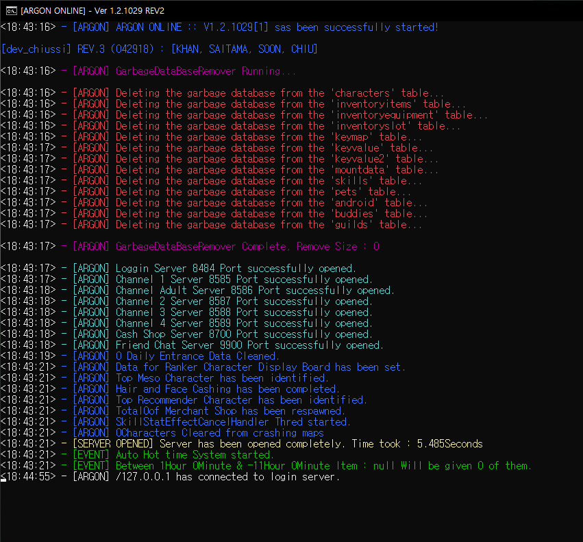

# Argon MS - Maplestory Clone Project

Welcome to Argon MS, a clone project of the popular game Maplestory, translating in to English (GMS standard)

**Please note that all rights related to the original game Maplestory belong to Nexon. This project is a clone and is not affiliated with Nexon.**


KMST v1029

## 🛠️- Tools

- **Java JDK 8**: ☕ The core language used for development.
- **MariaDB**: 🗃️ Used for the server database.
- **MySQL Client**: 📊 Used for database management.
- **SQL**: 📑 Managing and manipulating the database.
- **JavaScript**: 📜 Used for creating NPC scripts.
- **OllyDBG**: 🔍 Client Reverse Engineering.
- **Bash**: 🖥️ Used for scripting and automation.
- **WIZET**: Game image data files.
- **HaRepacker**: [Link to HaRepacker](https://github.com/lastbattle/Harepacker-resurrected)
- **XML**: 📦 Used for storing data in a format that can be easily shared.


## Getting Started

These instructions will get you a copy of the project up and running on your local machine for development and testing purposes.

### Prerequisites

- Java JDK 8
- MariaDB
- MySQL Client

### Clone

1. Clone the repo
   ```sh
   git clone https://github.com/yiwoduf/Argon-MS.git
   ```



### Server Configuration

```js
#   [맵설정]
시작맵 = 350140100
마을맵 = 100000000

#   [배율설정]
경험치배율 = 10
메소배율 = 1
드롭배율 = 1
캐시배율 = 1
보스캐시배율 = 4

#   [개수설정]
최대드랍아이템개수 = 4
최대보스드랍아이템개수 = 4
서버개수 = 5
캐릭터슬롯 = 4
아이피당계정수 = 3

#   [서버상태설정]
Flag = 2
아이피 = 127.0.0.1
이벤트 = 1
로그인포트 = 8484
채널포트 = 8585
캐시샵포트 = 8700
친구서버포트 = 9900

#   [기타설정]
서버점검 = false
패킷출력 = true
최대드랍사용 = true
최대보스드랍사용 = true
붐업경험치이벤트 = false

#   [DB]
Arc.dbHost = localhost
Arc.dbPort = 3306
Arc.dbUser = root
Arc.dbPassword =

#    [클라이언트 버전]
클라이언트버전 = 1029
마이너버전 = 1

```

### Most Recent Development Log:

```
Argon Online Development Log _ @yiwoduf

[FIX] - FIXED
[ISSUE] - Can think about it later, kinda easy to fix maybe
[COMPLETE] - completed and checked
[] - Needs to be done

001. [FIX] - Evan Fushion Skills are not working properly (Packet) Credit. @Song Min Woo
002. [FIX] - Evan's Dragon Mir gets smaller whenever you return to mainMap
003. [FIX] - Boss Monster doesn't drop Items that are in database (drop_data)
004. [FIX] - Blaster 'Hyper Magnum Punch' Skill doesn't give damage to mob
005. [FIX] - Evan after use of Hyper 'Dragon Master'Mir Dissapears (can't use skill) Credit. 송민우
006. MobHandler - movemonster or something error keeps apearing on promt. Have no idea what is wrong. No effect in game.
007. [COMPLETE] - if Player isGM, print Skill information
008. [COMPLETE] - Kinesis, Grab and few other skills don't work (키네시스 각종 오류 : PsychicEnergeShield PlayerStats.java 에 추가)
009. [] - Need to add WildHunter Jaguar changing script npc on keyvalue2
010. [] - Need to check if Auction system is working
011. [COMPLETE] - Memory cleaning system check
012. [FIX] - Wild Hunter Jaguar riding buffstat is not working right
013. [COMPLETE] - Mechanic Job riding Buffstat system needs to be fixed
014. [FIX] - Kinesis no damage to mobs when it has Donation Point damage (addDamage)
015. []- wz_mobskilldata query table is mossing. I need to add based on what info it has
016. [COMPLETE] - Translate and clean admin tool
017. [COMPLETE] - check addDamage and addDamageHit system
018. [FIX] - Additional hit gainAddDamageHit method does not work propertly (MapleCharacter.java)
019. [COMPLETE] - Need to add gainAddDamageHit npc script : 9000224
020. [] - Need to change and design JOB selecting npc (it looks dirty)
021. [] - Pinkbean event from my old server pack needs to be copied to argon (job with mikhail)
022. [FIX] - Aran Combo resets when it reaches 50 (applyComboBuff)
023. [] - Aran exceeds 1000 combo, adrenaline boost needs to happen
024. [] - GM Command !하이드 doesn't work properly
025. [COMPLETE] - Add Damage Skin array to Source
026. [COMPLETE] - Add New Ridings in Client (I have no idea how to add skill.wz, but riding it self is in it)
027. [FIX] - Character does not get Riding BuffStat. It says 'unknown error'
028. [FIX] - SkillStatEffect Riding buffstat error
029. [] - Need to add flyriding system to argon from aplus ( giveSpecialMount )
030. [COMPLETE] - Disable not used AdminTool (ChatHandler.Java) (Start.java)
031. Some damages with damageskin does not apply (must be a damage that is not applied)
032. [FIX] - InGame Chat is delayed. It responds 10sec~1min late( private void broadcastMessage / MapleMap.java )
033. [FIX] - Block Multi Loading Client does not work properly. Sometimes your cannot log back in.
034. [COMPLETE] - Add Trash Query Database cleaner
035. [FIX] - Evan 'Dragon Master' overlaps with other Ridings, so it doesn't work properly
036. [FIX] - ^ Why? 'Dragon Master' was in isMonsterRiding(), but separated to isEvanDragonMaster()
037. [] - 'Epic potential scroll 100%' says it's failed when item already has rare potential. It succeeds, but it says it failed.
038. [] - 'Unique potential scroll 100%' doesn't work at all
039. [] - In Database shop, the install tab sometimes is gone, and sometimes dissapears.
040. [FIX] - Return Town Scroll doesn't work (opcode + source) (modified to come to ServerConstants.mainMap)
041. [FIX] - Equi backup system doesn't work : 9000217 (Maybe check query)
042. [FIX] - Meso > Cash / Cash > Meso Market doesn't work (query)
043. [COMPLETE] - All source that goes to henesys individually was changed to ServerConstants.mainMap so they are equal (각종 마피아게임, 데미지측정, 결혼 등 다 이걸로이동)
044. [] - Function Systems from my old pack need to be added to argon
045. [] - Contents/Features Systems from my old pack need to be added to argon
046. [] - Add missing query tables and clean un-needed tables
047. [ISSUE] - Link Skills needs to be checked (I think some jobs don't work)
048. [ISSUE] - Does profession work? it should, but I need to check npc scripts
049. [] - Re design rebirth system
050. [] - Add pandora box system
051. [] - Fishing Feature doesn't work
052. [FIX] - Monster Park doesn't work (still need to add scripts and modify)
053. [FIX] - When you buy set items (ex. set of 100) from shops it only gives you 1
054. [FIX] - After you buy items from shops, there is a delay that makes you cant buy items
055. [ISSUE] - Zero gets weird after job script, It says this job cant have that item -_- just weird, but I will find them why
056. [ISSUE] - Zero beauty system needs to be checked like hair and face for individual sex, male and female
057. [ISSUE] - Zero, Beta isn't holding a cash weaponn in character select screen even when it is equipped. It is on when you are in game tho.
058. [COMPLETE] - Zero weapon upgrade needs to be set all the way up to new LV. 200 weapons (1029 only allows til lv 150 ones)
059. [] - Zero weapon damage and options needs to be changed to actual server like. I just copied and paste the option from now.

060. [FIX] - Zero Skill Master problem. Hyperskill wont show up : MapleCharacter.zeroSkillMaster();
061. [FIX] - Lags when you use town return scroll
062. Need to implement new soul weapons (Demian, Lucid)
063. [FIX] - Admin Command 'delete NPC' not working
064. [FIX] - NPC creation script not working properly - AutoNPCWriter
065. [COMPLETE] - Implement Gemstone (Nodestone) System
066. [] - Zakum, etc error with XML files - need to export from originial IMG files
067. [FIX] - ** Class 'Zero' has damage attack issue - no damage to mobs : DamageParse
068. [] - Add Union, Rank Information to Character view UI
069. [FIX] - Female Beauty lense crashes client - wrong IMG code
070. [FIX] - Limit Char creation with MAX_CHAR
071. [COMPLETE] - Implement Admin command for deleting fixed NPC on field
072. [FIX] - Mikhail Job not updating
073. [FIX] - Mikhail Job not updating through NPC
074. [FIX] - Mikhail 1st through 4th Job update not working LV 30, 60, 100 되도 n차 전직이 되지 않음
075. [FIX] - Mikhail Skill 'Soul driver' level only reaches 20 (MAX: 20)
076. [] - Mikhail 3rd job skill 'Soul link' 51111008 On/Off skill not working properly (temp fix with right-click)
077. [COMPLETE] - Add storage level limit for characters. Gift newbie gift only for first char.
078. [FIX] - Storage loading takes too long (DB connection)
079. [COMPLETE] - Add Pink Bean Job system
080. [FIX] - Pink Bean Skill Yo-Yo not working properly
081. [] - Pink Bean Yo-Yo stack should be implemented


	else {
		cm.dispose();
	} // close NPC without error, please use dispose()
```

Project Link: https://github.com/yiwoduf/Argon-MS
